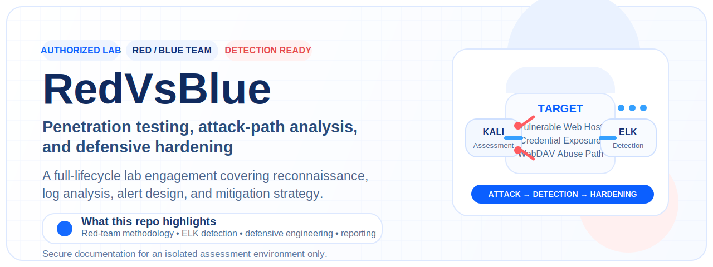
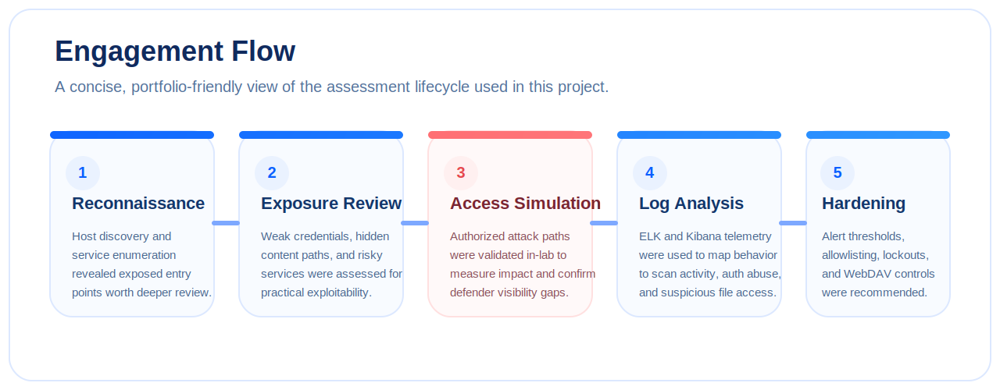
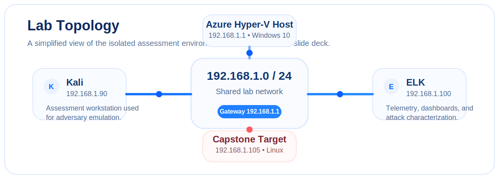
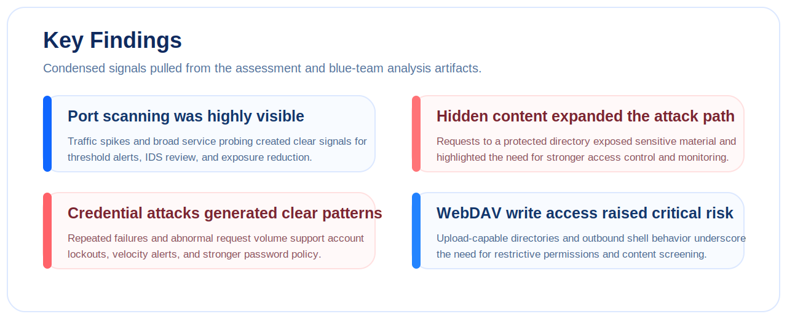

  

  <strong>Authorized adversary emulation, defensive log analysis, and hardening recommendations for a vulnerable web environment.</strong>

  <a href="#overview">Overview</a> •
  <a href="#engagement-at-a-glance">Engagement Flow</a> •
  <a href="#lab-environment">Lab Environment</a> •
  <a href="#key-findings">Key Findings</a> •
  <a href="#artifacts">Artifacts</a> •
  <a href="#skills-demonstrated">Skills Demonstrated</a>

---

## Overview

**RedVsBlue** captures a full security engagement in a controlled lab, pairing red-team activity with blue-team visibility and defensive hardening. The repository focuses on how a vulnerable web environment can be mapped, assessed, observed through telemetry, and translated into practical mitigation strategy.

This project is especially useful as a showcase of:

- penetration testing methodology
- attack-path analysis
- ELK / Kibana log review
- detection engineering thinking
- mitigation planning and control design
- concise security reporting for technical and non-technical audiences

> **Responsible use:** all assessment activity documented here was performed in an isolated, authorized environment created for security testing and analysis.

## Engagement at a Glance

| Phase | Focus | Outcome |
| --- | --- | --- |
| Reconnaissance | Host discovery, service enumeration, and surface mapping | Identified exposed services and likely attack paths |
| Exposure Review | Hidden content, weak authentication, risky services | Prioritized practical weaknesses for validation |
| Access Simulation | Confirmed in-lab abuse paths and authenticated access risk | Demonstrated business impact and attacker options |
| Log Analysis | Reviewed telemetry in ELK / Kibana | Mapped attacker actions to observable signals |
| Hardening | Proposed alerts, thresholds, and control improvements | Turned findings into actionable defense guidance |

## Lab Environment

  

| Component | Host / Role | Notes |
| --- | --- | --- |
| Kali | `192.168.1.90` | Assessment workstation used for authorized testing |
| Capstone Target | `192.168.1.105` | Vulnerable Linux host under assessment |
| ELK | `192.168.1.100` | Centralized telemetry and Kibana dashboards |
| Azure Hyper-V Host | `192.168.1.1` | Virtualization host for the lab |
| Network | `192.168.1.0/24` | Isolated engagement segment |

## Key Findings

The assessment and log-review artifacts consistently point to four major themes:

| Finding | What it demonstrated | Defensive takeaway |
| --- | --- | --- |
| Port scanning activity was highly visible | Large spikes in traffic and broad service probing created strong detection opportunities | Add connection-threshold alerts, review IDS signatures, and reduce exposed services |
| Hidden content and weak access control expanded the attack path | Requests to protected content exposed sensitive information and enabled deeper follow-on activity | Remove sensitive references, restrict access, and monitor high-risk directories |
| Credential attacks left clear patterns in telemetry | Repeated failures and abnormal request volume made brute-force activity distinguishable | Enforce lockouts, rate limits, stronger password policy, and authentication failure alerts |
| Write-capable WebDAV access materially increased risk | File upload behavior and shell-like activity highlighted a critical path to host compromise | Restrict methods, reduce write access, whitelist IPs, and inspect uploaded content |

### Signals captured in the blue-team analysis artifacts

- **Port scan:** high-volume spike beginning on **Nov 11, 2021** around midnight
- **Hidden directory requests:** **40,238** requests targeting `/secret_folder`
- **Credential attack activity:** **143,332** brute-force hits with **35** successful responses returning `301`
- **WebDAV access:** **124** attempts against `/webdav`, including access to `/passwd.dav` and `/shell.php`

## Detection and Hardening Priorities

The defensive side of this project focuses on translating attacker behavior into controls that are realistic, monitorable, and actionable.

### Recommended alerting themes

- abnormal connection volume and scan behavior
- repeated authentication failures across HTTP and SSH
- access attempts to hidden or restricted directories
- write operations to sensitive web directories
- suspicious outbound connections and reverse-shell style activity

### Recommended control improvements

- close or restrict unnecessary ports and services
- add IP allowlisting where feasible
- increase password strength and credential hygiene requirements
- enforce lockout / timeout policy after repeated failures
- reduce write permissions for WebDAV and limit allowed file types
- add anti-malware or content inspection on file uploads
- continuously review dashboards, IDS rules, and firewall posture

For a longer written summary, see [docs/ENGAGEMENT-SUMMARY.md](docs/ENGAGEMENT-SUMMARY.md).

## Artifacts

This repository keeps the original reporting artifacts and supplements them with a cleaner GitHub landing page.

| Artifact | Description |
| --- | --- |
| [Redteam.pptx](./Redteam.pptx) | Red-team assessment narrative, attack path, and validation steps |
| [Log Analysis.pptx](./Log%20Analysis.pptx) | Blue-team review of telemetry and attack characterization |
| [Mitigation.pptx](./Mitigation.pptx) | Proposed alerts, hardening actions, and risk reduction plan |
| [RedVsBlueProject2.pptx.pdf](./RedVsBlueProject2.pptx.pdf) | Portable PDF version of the engagement deck |
| [docs/ENGAGEMENT-SUMMARY.md](docs/ENGAGEMENT-SUMMARY.md) | Expanded written summary for GitHub readers |
| [docs/assets](docs/assets) | README graphics used to present the project cleanly |

## Skills Demonstrated

- penetration testing in an isolated lab environment
- network and service enumeration
- attack-path development and security validation
- credential attack analysis
- ELK / Kibana log investigation
- incident characterization and evidence mapping
- detection engineering mindset
- mitigation planning and security hardening
- clear technical reporting for stakeholders

## Why this project matters

RedVsBlue is valuable because it does more than document a single security finding. It shows the full chain:

1. how weaknesses are discovered,
2. how they can be combined into meaningful attacker progress,
3. how those actions surface in logs,
4. and how defenders can respond with better visibility and stronger controls.

That end-to-end perspective is what makes the project a strong security showcase.

---

  Built for clear technical storytelling, responsible security documentation, and polished GitHub presentation.

